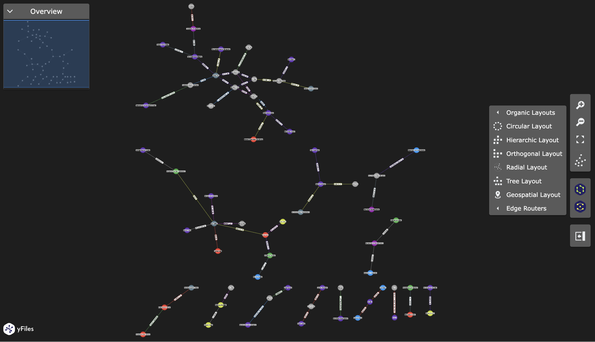

# Local GraphRAG Project

 

## Overview
A Local GraphRAG (Graph Retrieval-Augmented Generation) Project that leverages the power of **LangChain**, **Neo4j**, and **llama3.1** to enable natural language querying over a graph database, enhancing **context-aware AI responses**.

## Features
- Seamless integration with Neo4j for graph database management.
- Utilizes Llama 3.1 for enhanced data processing capabilities.
- Supports embedding with `mxbai-embed-large` for improved data representation.

## Prerequisite
- Docker (for Neo4j)
- Ollama (for Running LLM and Embeddings )
    - LLM: Llama 3.1. run `ollama run llama3.1`
    - Embedding Model: mxbai-embed-large run `ollama pull mxbai-embed-large`

## Setting Up
1. Ensure Neo4j auth credentials matches with `.env`
2. Run `docker-compose up` to set up Neo4j locally.
3. Run `localcuisine.ipynb` to get started.

